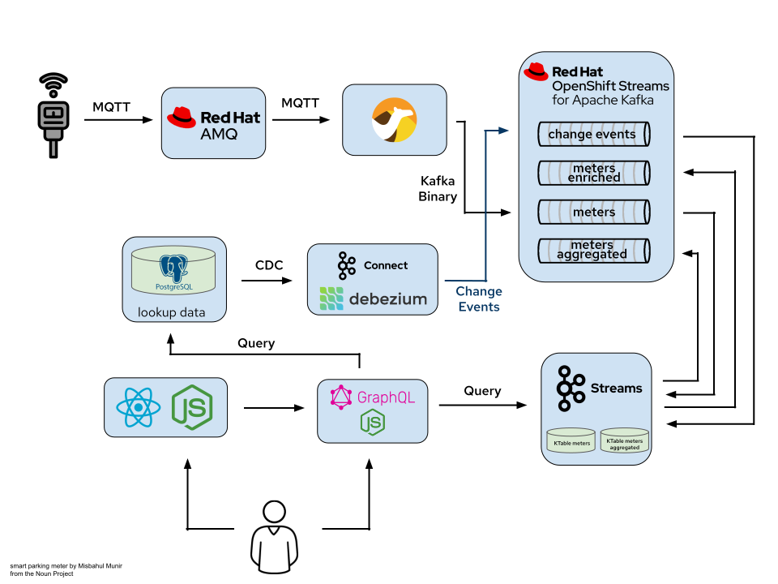
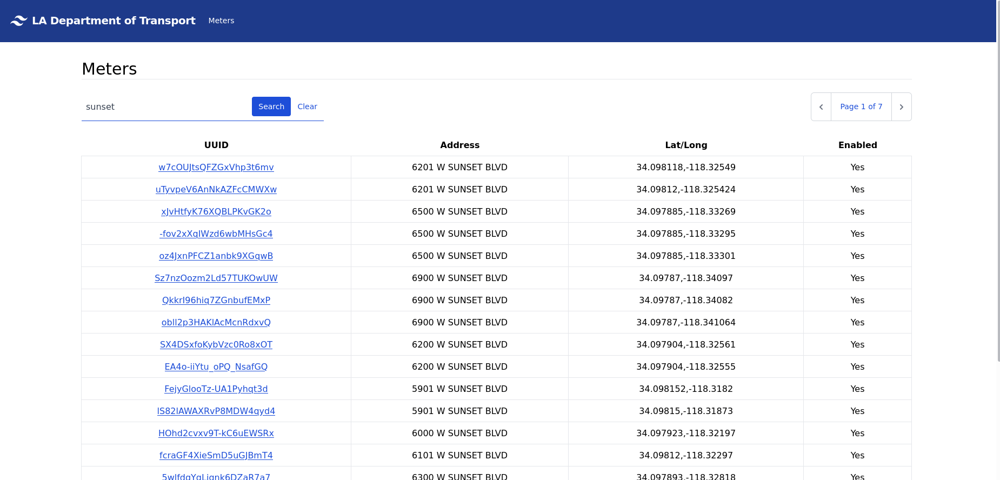
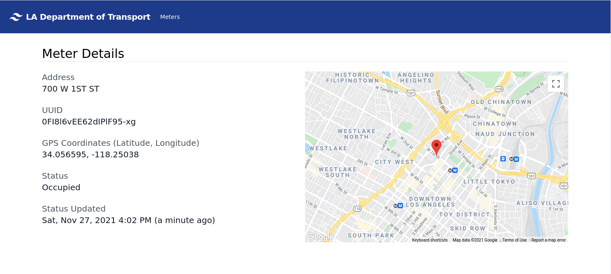
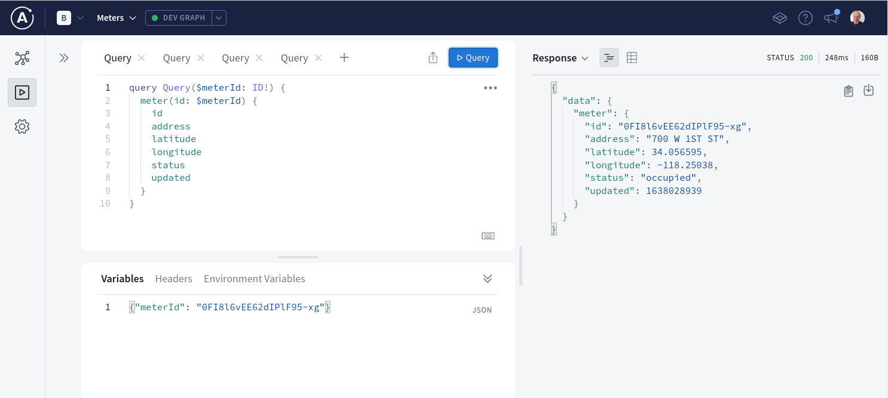
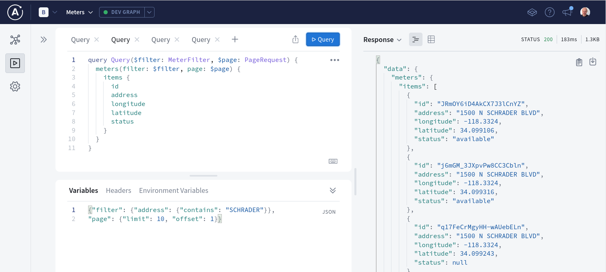
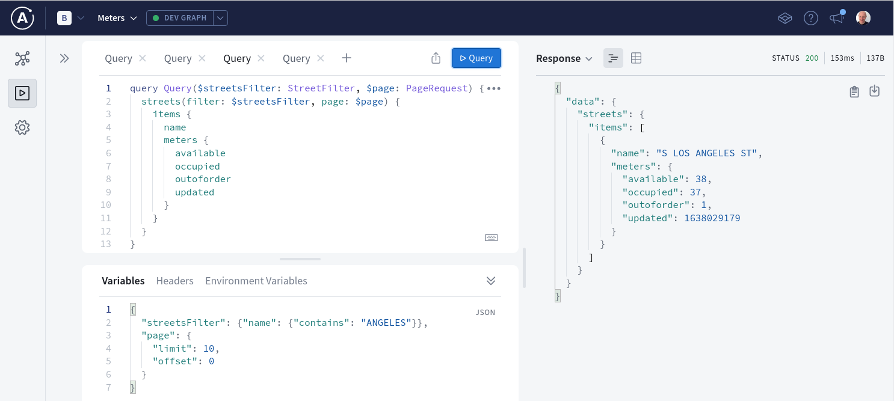

:noaudio:
:scrollbar:
:toc2:
:linkattrs:
:data-uri:

== Kafka on the Edge: IoT scenario with OpenShift Streams for Apache Kafka

This demo illustrates how you you can use a Kafka cloud service like OpenShift Streams for Apache Kafka to build IoT solutions.

In this demo, you use a collection of smart parking meters situated in the city of Los Angeles which send out MQTT messages about their status to a MQTT broker. These messages are pushed to a Kafka topic resulting in a stream of parking meters updates. Using Kafka Streams, this stream is enriched and aggregated and used for real-time analysis.

[NOTE]
====
This demo and its components _are not_ affiliated with the City of Los Angeles - this is a hypothetical scenario.

The demo _does_ use a public data set data scraped from link:https://geohub.lacity.org[City of Los Angeles GeoHub APIs, window="_blank"].
====

:numbered:

== Architecture

A schematic overview of the architecture:

The demo consists of the following components:

* Streams for Apache Kafka: Kafka instance used by the demo.
* iot-generator: Quarkus application which simulates the parking meters. Sends a meter update MQTT message every 250ms. +
Source code: link:https://github.com/rh-bu-cs-rhosak-iot/iot-data-mqtt-generator[]
* AMQ broker: AMQ 7.9 broker configured to act as MQTT broker.
* mqtt2kafka: Camel application running on Quarkus. Consumes MQTT messages from the AMQ broker and transforms the messages into Kafka messages which are sent to the `iot-meters` topic of the Streams for Apache Kafka instance. +
Source code: link:https://github.com/rh-bu-cs-rhosak-iot/mqtt2kafka-quarkus[]
* PostgreSQL database: contains static data (address, coordinates) of parking meters.
* Kafka Connect and Debezium PostgreSQL connector: captures the records in the PostgreSQL database as Change Data Events and pushes the events to a topic of the Streams for Apache Kafka instance.
* iot-streams: Kafka Streams Quarkus application. +
Source code: link:https://github.com/rh-bu-cs-rhosak-iot/iot-streams[] +
Builds a Kafka Streams topology to:
** enrich the parking meter updates stream with the static parking meter data obtained from PostgreSQL with Debezium.
** aggregate the parking meters updates stream by street.
** store the parking meter updates stream and the aggegated stream into local KTables.
* iot-graphql-api: NodeJS application that exposes a GraphQL API which combines data from the PostgreSQL database with data from the KTables in the `iot-streams` application. +
Source code: link:https://github.com/rh-bu-cs-rhosak-iot/iot-graphql-api[]
* iot-ui: React/NodeJS UI application. Uses the GraphQL API to search for and display information about parking meters. +
Source code: link:https://github.com/rh-bu-cs-rhosak-iot/iot-ui[]

Except for the OpenShift Streams for Apache Kafka instance, all the components run on OpenShift.

== Prerequisites

To install and run the demo you need:

* Access to an OpenShift cluster with cluster-admin access. The installation instructions and Ansible playbooks were tested with OpenShift 4.9.
* The `oc` OpenShift CLI.
* The Red Hat OpenShift Application Services `rhoas` CLI. You can obtain the CLI from link:https://github.com/redhat-developer/app-services-cli/releases[here].
* Ansible version >= 2.9.0. The installation playbooks make intensive use of the Ansible Kubernetes module, so this module needs to be available.
* A Red Hat account. If you do not have an account yet, you can create on as part of the OpenShift Streams for Apache Kafka provisioning process.

== Installation

=== OpenShift Streams for Apache Kafka

As part of the developer program for OpenShift Streams for Apache Kafka, everybody with a Red Hat account can create a Kafka instance free of charge. This Kafka instance will remain active for 48 hrs.

To create a Kafka instance:

. Log with the `rhoas` CLI into link:https:cloud.redhat.com[console.redhat.com]
+
[source,bash]
----
$ rhoas login
----
+
This command initiates a browser based login procedure. In the browser window, login with your Red Hat account credentials.
. Create a Kafka instance. Depending on your location, choose `us-east-1` or `eu-west-1` as region.
+
----
$ rhoas kafka create --name iot-meters --region us-east-1
----
+
.Output
----
{
  "cloud_provider": "aws",
  "created_at": "2021-11-25T16:50:17.765633394Z",
  "href": "/api/kafkas_mgmt/v1/kafkas/c6frtiaoc87835m0ddm0",
  "id": "c6frtiaoc87835m0ddm0",
  "instance_type": "eval",
  "kind": "Kafka",
  "multi_az": true,
  "name": "iot-meters",
  "owner": "rh-bu-cloudservices-tmm",
  "reauthentication_enabled": true,
  "region": "eu-west-1",
  "status": "accepted",
  "updated_at": "2021-11-25T16:50:17.765633394Z"
}

Kafka instance "iot-meters" is being created. To monitor its status run "rhoas status"
----
. Once your Kafka instance is ready, create the `iot-meters` and `iot-meters-enriched` topics.
+
[source,bash]
----
$ rhoas kafka use --name iot-meters
$ rhoas kafka topic create --name iot-meters --partitions 15
$ rhoas kafka topic create --name iot-meters-enriched --partitions 15
----

. Configure access permissions to the Kafka instance. For this demo, you grant access to all accounts for all topics and consumer groups.
+
[source,bash]
----
$ rhoas kafka acl grant-access --producer --consumer --all-accounts --topic all --group all -y
----
+
.Output
----
The following ACL rule is going to be created:

  PRINCIPAL (7)    PERMISSION   OPERATION   DESCRIPTION
 ---------------- ------------ ----------- -------------------------
  All Accounts     allow        describe    topic is "*"
  All Accounts     allow        read        topic is "*"
  All Accounts     allow        read        group is "*"
  All Accounts     allow        write       topic is "*"
  All Accounts     allow        create      topic is "*"
  All Accounts     allow        write       transactional-id is "*"
  All Accounts     allow        describe    transactional-id is "*"

✔️  ACLs successfully created in the Kafka instance "iot-meters"
----

=== OpenShift Operators

For the demo you need a couple of operators in the OpenShift cluster. The easiest way to install these is through OLM.

Open a browser to the OpenShift Console of your OpenShift cluster. From the _Operator Hub_ page, install the following operators:

* `Red Hat Integration - AMQ Streams`
* `Red Hat Integration - AMQ Broker for RHEL 8 (Multiarch)`
* `OpenShift Application Services (RHOAS)`

=== OpenShift Project

. Log in into OpenShift with the `oc` client as a cluster-admin user, and create a new project.
+
[source,bash]
----
$ oc new-project iot-meters
----
. Set the project as the current project for `oc`.
+
[source,bash]
----
$ oc project iot-meters
----

=== Connect the Streams for Apache Kafka instance

Using the `rhoas` CLI, you connect your OpenShift cluster to the Streams for Apache Kafka instance. This will create a service account for the Kafka service, as well as a _KafkaConnection_ custom resource which contains all the details for applications to connect to the Kafka instance.

. Obtain an offline API token for link:https://console.redhat.com[console.redhat.com]. In a browser window, navigate to link:https://console.redhat.com/openshift/token[]. Login if needed with your Red Hat account. Click the _Load token_ button, and copy the API token.
. Set the value of the token as a system variable.
+
[source,bash]
----
$ export TOKEN=<offline token value>
----
. Connect the Kafka instance
+
[source,bash]
----
$ rhoas cluster connect --service-type kafka --service-name iot-meters -n iot-meters --token $TOKEN -y
----
+
.Output
----
This command will link your cluster with Cloud Services by creating custom resources and secrets.
In case of problems please execute "rhoas cluster status" to check if your cluster is properly configured

Connection Details:

Service Type:                   kafka
Service Name:                   iot-meters
Kubernetes Namespace:           iot-meters
Service Account Secret:         rh-cloud-services-service-account

✔️  Token Secret "rh-cloud-services-accesstoken" created successfully
✔️  Service Account Secret "rh-cloud-services-service-account" created successfully

Client ID:     srvc-acct-9e8450ca-86b5-4fbd-8e3b-xxxxxxxxxxxx

Make a copy of the client ID to store in a safe place. Credentials won't appear again after closing the terminal.

You will need to assign permissions to service account in order to use it.

You need to separately grant service account access to Kafka by issuing following command

  $ rhoas kafka acl grant-access --producer --consumer --service-account srvc-acct-9e8450ca-86b5-4fbd-8e3b-xxxxxxxxxxxx --topic all --group all

✔️  kafka resource "iot-meters" has been created
Waiting for status from kafka resource.
Created kafka can be already injected to your application.

To bind you need to have Service Binding Operator installed:
https://github.com/redhat-developer/service-binding-operator

You can bind kafka to your application by executing "rhoas cluster bind"
or directly in the OpenShift Console topology view.

✔️  Connection to service successful.
----

=== Application Services

Run the Ansible playbook in the `ansible` directory to install the different components of the demo.

. Clone this repo and change directory to the `ansible` directory.
. Copy the `inventory.template` file.
+
[source,bash]
----
$ cp inventories/inventory.template inventories/inventory
----
. The UI application uses the Google Maps API to show the location of the parking meters on a map. This requires a valid Google Developer API Key with Google Maps enabled. You can get an API key from the link:https://console.developers.google.com[Google Developer Console]. +
Copy the value of your Google Developer API Key in the `inventory file`.
+
----
# iot-ui-app application
iot_ui_image=quay.io/rhosak_iot/iot-ui:latest
iot_ui_host_subdomain=iot-app
iot_ui_google_maps_api_key=<value of the Google Developer API Key>
----
+
NOTE: This step is optional. The application works equally well without API key.

. Make sure you are logged in to the OpenShift cluster with the `oc` client.
. Run the Ansible playbook.
+
[source,bash]
----
$ ansible/playbook -i inventories/inventory playbooks/install.yml
----
+
The playbook installs all components. However some components are initially installed with 0 replicas. This is the case for Kafka Connect, the Kafka Streams application (_iot-streams_), the Camel application (_mqtt2kafka_) and the data generator application (_iot-data-generator_).
+
The playbook is idempotent. If a goal fails, fix the issue and run the playbook again.

== Run the Demo

. Scale up Kafka Connect.
+
[source,bash]
----
$ oc patch kafkaconnect iot-connect -n iot-meters --type='json' -p '[{"op": "replace", "path": "/spec/replicas", "value": 1}]'
----
. Once the Kafka Connect pod is up and runnng, check the topics of the Kafka instance. Notice the topics created by Kafka Connect:
+
[source,bash]
----
$ rhoas kafka topic list
----
+
.Output
----
  NAME (6)                         PARTITIONS   RETENTION TIME (MS)   RETENTION SIZE (BYTES)
 -------------------------------- ------------ --------------------- ------------------------
  city_info.updates.public.meter           15   604800000             -1 (Unlimited)
  iot-connect-configs                       1   604800000             -1 (Unlimited)
  iot-connect-offsets                      25   604800000             -1 (Unlimited)
  iot-connect-status                        5   604800000             -1 (Unlimited)
  iot-meters                               15   604800000             -1 (Unlimited)
  iot-meters-enriched                      15   604800000             -1 (Unlimited)
----
+
`city_info.updates.public.meter` is the topic that contains the change events picked up by Debezium from the PostgreSQL `meter` table.
. Use a tool like _kcat_ (link:https://github.com/edenhill/kcat) or _kafdrop_ (https://github.com/obsidiandynamics/kafdrop) to browse messages in the `city_info.updates.public.meter` topic. +
Notice there is one change event message per meter. The payload of every message is like:
+
----
{
    "before": null,
    "after": {
        "id": "CltNjN11WxrlcZX1RnJZJ",
        "address": "900 S CROCKER ST",
        "latitude": 34.03523,
        "longitude": -118.249985
    },
    "source": {
        "version": "1.7.0.Final",
        "connector": "postgresql",
        "name": "city_info.updates",
        "ts_ms": 1638013647892,
        "snapshot": "true",
        "db": "city_info",
        "sequence": "[null,\"25008760\"]",
        "schema": "public",
        "table": "meter",
        "txId": 507,
        "lsn": 25008760,
        "xmin": null
    },
    "op": "r",
    "ts_ms": 1638013647892,
    "transaction": null
}
----
. Scale up the Camel application:
+
[source,bash]
----
$ oc scale deployment mqtt2kafka -n iot-meters --replicas=1
----
+
Check the logs of the application and verify the application connects successfully to the MQTT broker and the Kafka instance.
+
----
exec java -Dquarkus.http.host=0.0.0.0 -Djava.util.logging.manager=org.jboss.logmanager.LogManager -XX:+ExitOnOutOfMemoryError -cp . -jar /deployments/quarkus-run.jar
2021-11-27 17:26:14,294 INFO  [org.apa.cam.qua.cor.CamelBootstrapRecorder] (main) Bootstrap runtime: org.apache.camel.quarkus.main.CamelMainRuntime
2021-11-27 17:26:14,895 INFO  [org.apa.cam.mai.BaseMainSupport] (main) Auto-configuration summary
2021-11-27 17:26:14,898 INFO  [org.apa.cam.mai.BaseMainSupport] (main)     camel.context.name=quarkus-camel
2021-11-27 17:26:14,899 INFO  [org.apa.cam.mai.BaseMainSupport] (main)     camel.component.kafka.saslJaasConfig=xxxxxx
2021-11-27 17:26:14,899 INFO  [org.apa.cam.mai.BaseMainSupport] (main)     camel.component.kafka.sslTruststorePassword=xxxxxx
2021-11-27 17:26:14,900 INFO  [org.apa.cam.mai.BaseMainSupport] (main)     camel.component.kafka.securityProtocol=SASL_SSL
2021-11-27 17:26:14,900 INFO  [org.apa.cam.mai.BaseMainSupport] (main)     camel.component.kafka.sslTruststoreLocation=/etc/pki/ca-trust/extracted/java/cacerts
2021-11-27 17:26:14,900 INFO  [org.apa.cam.mai.BaseMainSupport] (main)     camel.component.kafka.saslMechanism=PLAIN
2021-11-27 17:26:14,901 INFO  [org.apa.cam.mai.BaseMainSupport] (main)     camel.component.kafka.brokers=iot-meters-c-h--bj-a-ljlm-sfk-a.bf2.kafka.rhcloud.com:443
2021-11-27 17:26:18,293 INFO  [org.apa.kaf.com.sec.aut.AbstractLogin] (main) Successfully logged in.
2021-11-27 17:26:20,090 WARN  [org.apa.kaf.cli.pro.ProducerConfig] (main) The configuration 'sasl.kerberos.ticket.renew.window.factor' was supplied but isn't a known config.
2021-11-27 17:26:20,092 WARN  [org.apa.kaf.cli.pro.ProducerConfig] (main) The configuration 'sasl.kerberos.kinit.cmd' was supplied but isn't a known config.
2021-11-27 17:26:20,092 WARN  [org.apa.kaf.cli.pro.ProducerConfig] (main) The configuration 'sasl.kerberos.ticket.renew.jitter' was supplied but isn't a known config.
2021-11-27 17:26:20,093 WARN  [org.apa.kaf.cli.pro.ProducerConfig] (main) The configuration 'sasl.kerberos.min.time.before.relogin' was supplied but isn't a known config.
2021-11-27 17:26:22,291 INFO  [org.apa.cam.imp.eng.AbstractCamelContext] (main) Routes startup summary (total:1 started:1)
2021-11-27 17:26:22,291 INFO  [org.apa.cam.imp.eng.AbstractCamelContext] (main)     Started route1 (paho://iot/meters)
2021-11-27 17:26:22,292 INFO  [org.apa.cam.imp.eng.AbstractCamelContext] (main) Apache Camel 3.12.0 (quarkus-camel) started in 6s901ms (build:0ms init:1s302ms start:5s599ms)
2021-11-27 17:26:23,792 INFO  [io.quarkus] (main) mqtt2kafka-quarkus 1.0.0-SNAPSHOT on JVM (powered by Quarkus 2.4.0.Final) started in 20.998s. Listening on: http://0.0.0.0:8080
2021-11-27 17:26:23,793 INFO  [io.quarkus] (main) Profile prod activated.
2021-11-27 17:26:23,793 INFO  [io.quarkus] (main) Installed features: [camel-core, camel-jsonpath, camel-kafka, camel-log, camel-microprofile-health, camel-paho, cdi, kafka-client, smallrye-context-propagation, smallrye-health, vertx]
----

. Scale up the Kafka Streams application:
+
[source,bash]
----
$ oc scale deployment iot-streams -n iot-meters --replicas=1
----
. Check the topics of the Kafka instance. Notice the topics created by Kafka Streams:
+
[source,bash]
----
$ rhoas kafka topic list --size 20
----
+
.Output
----
  NAME (11)                                                      PARTITIONS   RETENTION TIME (MS)   RETENTION SIZE (BYTES) 
 -------------------------------------------------------------- ------------ --------------------- ------------------------
  city_info.updates.public.meter                                         15   604800000             -1 (Unlimited)
  iot-connect-configs                                                     1   604800000             -1 (Unlimited)
  iot-connect-offsets                                                    25   604800000             -1 (Unlimited)
  iot-connect-status                                                      5   604800000             -1 (Unlimited)
  iot-meters                                                             15   604800000             -1 (Unlimited)
  iot-meters-enriched                                                    15   604800000             -1 (Unlimited)
  iot-streams-iot-meters-aggregated-store-changelog                      15   604800000             -1 (Unlimited)
  iot-streams-iot-meters-grouped-repartition                             15   -1 (Unlimited)        -1 (Unlimited)
  iot-streams-iot-meters-update-store-changelog                          15   604800000             -1 (Unlimited)
  iot-streams-KSTREAM-TOTABLE-STATE-STORE-0000000006-changelog           15   604800000             -1 (Unlimited)
  iot-streams-meter-info-ktable-repartition                              15   -1 (Unlimited)        -1 (Unlimited)
----

. Finally, scale up the datagenerator app.
+
[source,bash]
----
$ oc scale deployment iot-data-generator -n iot-meters --replicas=1
----
. Check the logs of the `mqtt2kafka` pod. After a couple of seconds you should see log statements of the parking meter update messages consumed by the app:
+
----
2021-11-27 17:26:14,294 INFO  [org.apa.cam.qua.cor.CamelBootstrapRecorder] (main) Bootstrap runtime: org.apache.camel.quarkus.main.CamelMainRuntime
2021-11-27 17:26:14,895 INFO  [org.apa.cam.mai.BaseMainSupport] (main) Auto-configuration summary
2021-11-27 17:26:14,898 INFO  [org.apa.cam.mai.BaseMainSupport] (main)     camel.context.name=quarkus-camel
2021-11-27 17:26:14,899 INFO  [org.apa.cam.mai.BaseMainSupport] (main)     camel.component.kafka.saslJaasConfig=xxxxxx
2021-11-27 17:26:14,899 INFO  [org.apa.cam.mai.BaseMainSupport] (main)     camel.component.kafka.sslTruststorePassword=xxxxxx
2021-11-27 17:26:14,900 INFO  [org.apa.cam.mai.BaseMainSupport] (main)     camel.component.kafka.securityProtocol=SASL_SSL
2021-11-27 17:26:14,900 INFO  [org.apa.cam.mai.BaseMainSupport] (main)     camel.component.kafka.sslTruststoreLocation=/etc/pki/ca-trust/extracted/java/cacerts
2021-11-27 17:26:14,900 INFO  [org.apa.cam.mai.BaseMainSupport] (main)     camel.component.kafka.saslMechanism=PLAIN
2021-11-27 17:26:14,901 INFO  [org.apa.cam.mai.BaseMainSupport] (main)     camel.component.kafka.brokers=iot-meters-c-h--bj-a-ljlm-sfk-a.bf2.kafka.rhcloud.com:443
2021-11-27 17:26:18,293 INFO  [org.apa.kaf.com.sec.aut.AbstractLogin] (main) Successfully logged in.
2021-11-27 17:26:20,090 WARN  [org.apa.kaf.cli.pro.ProducerConfig] (main) The configuration 'sasl.kerberos.ticket.renew.window.factor' was supplied but isn't a known config.
2021-11-27 17:26:20,092 WARN  [org.apa.kaf.cli.pro.ProducerConfig] (main) The configuration 'sasl.kerberos.kinit.cmd' was supplied but isn't a known config.
2021-11-27 17:26:20,092 WARN  [org.apa.kaf.cli.pro.ProducerConfig] (main) The configuration 'sasl.kerberos.ticket.renew.jitter' was supplied but isn't a known config.
2021-11-27 17:26:20,093 WARN  [org.apa.kaf.cli.pro.ProducerConfig] (main) The configuration 'sasl.kerberos.min.time.before.relogin' was supplied but isn't a known config.
2021-11-27 17:26:22,291 INFO  [org.apa.cam.imp.eng.AbstractCamelContext] (main) Routes startup summary (total:1 started:1)
2021-11-27 17:26:22,291 INFO  [org.apa.cam.imp.eng.AbstractCamelContext] (main)     Started route1 (paho://iot/meters)
2021-11-27 17:26:22,292 INFO  [org.apa.cam.imp.eng.AbstractCamelContext] (main) Apache Camel 3.12.0 (quarkus-camel) started in 6s901ms (build:0ms init:1s302ms start:5s599ms)
2021-11-27 17:26:23,792 INFO  [io.quarkus] (main) mqtt2kafka-quarkus 1.0.0-SNAPSHOT on JVM (powered by Quarkus 2.4.0.Final) started in 20.998s. Listening on: http://0.0.0.0:8080
2021-11-27 17:26:23,793 INFO  [io.quarkus] (main) Profile prod activated. 
2021-11-27 17:26:23,793 INFO  [io.quarkus] (main) Installed features: [camel-core, camel-jsonpath, camel-kafka, camel-log, camel-microprofile-health, camel-paho, cdi, kafka-client, smallrye-context-propagation, smallrye-health, vertx]
2021-11-28 17:46:33,798 INFO  [route1] (MQTT Call: camel-paho116526000662358) Message received: {"id":"XM_CVmnKEQhqJH7MIbDj2","prev":"NA","status":"available","timestamp":1638121589}
2021-11-28 17:46:34,593 INFO  [route1] (MQTT Call: camel-paho116526000662358) Message received: {"id":"tWlhbYAbji8nUzIYDEK94","prev":"NA","status":"available","timestamp":1638121593}
2021-11-28 17:46:34,594 INFO  [route1] (MQTT Call: camel-paho116526000662358) Message received: {"id":"DOB7YoOD-dZsRWEzqd8XY","prev":"NA","status":"occupied","timestamp":1638121594}
2021-11-28 17:46:34,596 INFO  [route1] (MQTT Call: camel-paho116526000662358) Message received: {"id":"JilBlUfrKYeKyhBNWSFcZ","prev":"NA","status":"available","timestamp":1638121594}
2021-11-28 17:46:34,625 INFO  [route1] (MQTT Call: camel-paho116526000662358) Message received: {"id":"85WtINd9JSNg5SVb83Zfa","prev":"NA","status":"available","timestamp":1638121594}
2021-11-28 17:46:34,876 INFO  [route1] (MQTT Call: camel-paho116526000662358) Message received: {"id":"RV_ga09GIo9TyjxQpig3Y","prev":"NA","status":"occupied","timestamp":1638121594}
2021-11-28 17:46:35,175 INFO  [route1] (MQTT Call: camel-paho116526000662358) Message received: {"id":"HzhBuicDTIir4Mi2F2RVy","prev":"NA","status":"occupied","timestamp":1638121595}
2021-11-28 17:46:35,390 INFO  [route1] (MQTT Call: camel-paho116526000662358) Message received: {"id":"OSFN_bVGWCO1WfMKN7zcn","prev":"NA","status":"available","timestamp":1638121595}
2021-11-28 17:46:35,625 INFO  [route1] (MQTT Call: camel-paho116526000662358) Message received: {"id":"VLHVet8VEDgUuJRvGiHWU","prev":"NA","status":"occupied","timestamp":1638121595}
2021-11-28 17:46:35,875 INFO  [route1] (MQTT Call: camel-paho116526000662358) Message received: {"id":"ytFimzyWNs-0TRwQ5IHZT","prev":"NA","status":"available","timestamp":1638121595}
2021-11-28 17:46:36,125 INFO  [route1] (MQTT Call: camel-paho116526000662358) Message received: {"id":"4WK5eRP0TGMDdWPKdjD57","prev":"NA","status":"available","timestamp":1638121596}
2021-11-28 17:46:36,375 INFO  [route1] (MQTT Call: camel-paho116526000662358) Message received: {"id":"lO2OVJCpHre5Ofi-5Lq1G","prev":"NA","status":"available","timestamp":1638121596}
2021-11-28 17:46:36,625 INFO  [route1] (MQTT Call: camel-paho116526000662358) Message received: {"id":"Qdb2a9SAWJxUeRijeTqQ3","prev":"NA","status":"occupied","timestamp":1638121596}
2021-11-28 17:46:36,875 INFO  [route1] (MQTT Call: camel-paho116526000662358) Message received: {"id":"Upp3N1_DasX6Xeb92-Uo_","prev":"NA","status":"occupied","timestamp":1638121596}
2021-11-28 17:46:37,126 INFO  [route1] (MQTT Call: camel-paho116526000662358) Message received: {"id":"xnV6H_hWGHH0E7o8BnJmY","prev":"NA","status":"occupied","timestamp":1638121597}
2021-11-28 17:46:37,375 INFO  [route1] (MQTT Call: camel-paho116526000662358) Message received: {"id":"OEhmVkwrIq52jbzIgUaH2","prev":"NA","status":"available","timestamp":1638121597}
2021-11-28 17:46:37,625 INFO  [route1] (MQTT Call: camel-paho116526000662358) Message received: {"id":"F0xMje8-qoDHmEmLq7Trd","prev":"NA","status":"occupied","timestamp":1638121597}
2021-11-28 17:46:37,875 INFO  [route1] (MQTT Call: camel-paho116526000662358) Message received: {"id":"0ggMqufizzJOVgjUBqXus","prev":"NA","status":"available","timestamp":1638121597}
2021-11-28 17:46:38,125 INFO  [route1] (MQTT Call: camel-paho116526000662358) Message received: {"id":"Wg_qQdcjpR9S2nQsWQmLZ","prev":"NA","status":"occupied","timestamp":1638121598}
2021-11-28 17:46:38,375 INFO  [route1] (MQTT Call: camel-paho116526000662358) Message received: {"id":"qAdJw-YCWphdYWVtIsXMV","prev":"NA","status":"occupied","timestamp":1638121598}
2021-11-28 17:46:38,625 INFO  [route1] (MQTT Call: camel-paho116526000662358) Message received: {"id":"fxxGBEiBYUtHTWIAfVQIR","prev":"NA","status":"available","timestamp":1638121598}
----

. Use a tool like _kcat_ or _kafdrop_ to browse messages in the `iot-meters`, `iot-meters-enriched` and `iot-streams-iot-meters-aggregated-store-changelog` topics. +
`iot-meters` contains the original meter status update messages, with the meter id as message key:
+
----
{"id":"XSGt2vhgUYdTZB0Gyyer5","prev":"available","status":"occupied","timestamp":1638029299}
----
+
`iot-meters-enriched` contains the meter status update messages enriched with meter data from the change events:
+
----
{"address":"601 S LOS ANGELES ST","id":"GZPHSM1yNf7B1xnOh1inL","latitude":34.043636,"longitude":-118.250145,"previousStatus":"NA","status":"available","timestamp":1638029331}
----
+
`iot-streams-iot-meters-aggregated-store-changelog` contains events aggregated per street, with the street as message key:
+
----
{"available":8,"occupied":7,"outoforder":0,"street":"N CHEROKEE AVE","timestamp":1638029328}
----

. In as browser window, navigate to the URL of the `iot-ui` application. Open the _meters_ tab. In the search box you can search by address fragment.
+

. Click on the link of an individual meter to view it's status:
+

+
Notice that the page displays information obtained from the database (ID, Address, Coordinates) with real-time information obtained from the `iot-meters` topic, materialized as a _KTable_ in the `iot-streams application`.
+
If the page displays `N/A` for the meter status, that means no update events for this meter have been produced yet.

. Another way to query the GraphQL API is through a GraphQL client application like link:https://studio.apollographql.com/[Apollo Studio]. +
Some examples:
+

+

+

== Credits

This demo builds heavily on previous work done by link:https://github.com/evanshortiss/[Evan Shortiss]. The workshop that inspired this demo can be found at link:https://github.com/RedHat-Middleware-Workshops/rhtr-2020-api-mgmt-kafka-workshop[].